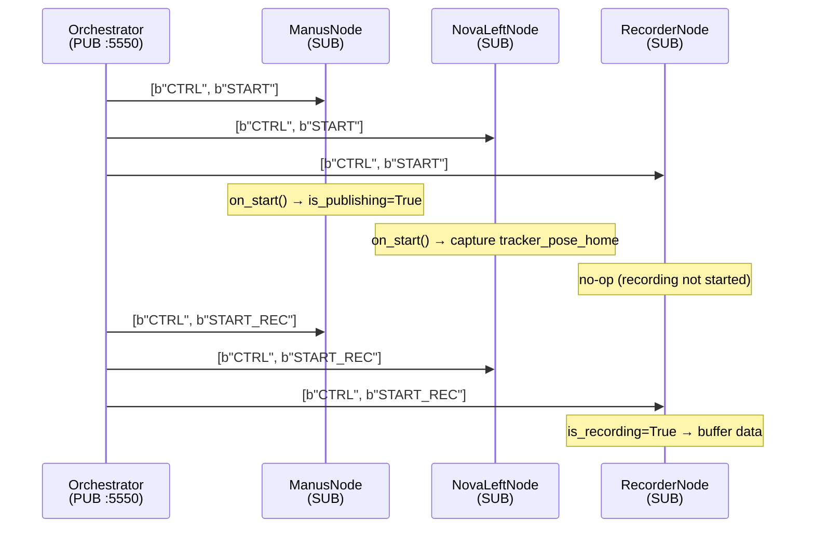
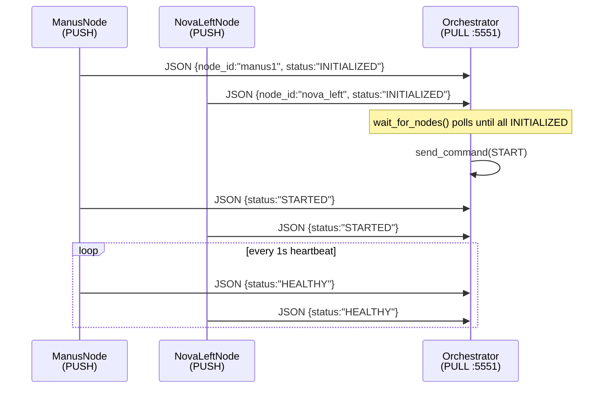
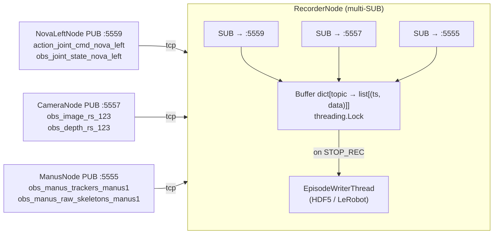

# ZMQ Pub/Sub Implementation: Comprehensive Analysis

> Analysis date: 2026-03-16 · Based on production implementation in `ts-bimanual-teleop`

---

## Table of Contents

1. [Executive Summary](#1-executive-summary)
2. [Three Communication Planes](#2-three-communication-planes)
3. [Port Map & Endpoint Registry](#3-port-map--endpoint-registry)
4. [Message Format & Serialization](#4-message-format--serialization)
5. [Topic Naming System](#5-topic-naming-system)
6. [Node Class Hierarchy](#6-node-class-hierarchy)
7. [Data Flow Diagrams](#7-data-flow-diagrams)
8. [Key Implementation Patterns](#8-key-implementation-patterns)
9. [Threading Model](#9-threading-model)
10. [Node Lifecycle State Machine](#10-node-lifecycle-state-machine)
11. [Notable Design Decisions](#11-notable-design-decisions)

---

## 1. Executive Summary

The codebase uses a **three-plane ZMQ architecture** to orchestrate a real-time bimanual teleop and data-collection system. All inter-process communication runs over TCP/ZMQ — there is no shared memory, ROS middleware, or message bus.

| Plane       | Pattern     | Role                                                                  |
| ----------- | ----------- | --------------------------------------------------------------------- |
| **Control** | PUB / SUB   | Orchestrator broadcasts lifecycle commands to all nodes               |
| **Status**  | PUSH / PULL | Each node pushes heartbeats/status back to the orchestrator           |
| **Data**    | PUB / SUB   | Sensor & robot nodes publish streams; consumers & recorders subscribe |

The three planes are **independent** TCP connections running on separate ports (5550/5551/555x). This keeps the low-latency data path (60–120 Hz sensor data) entirely separate from the low-frequency control and monitoring paths.

The implementation is layered: the `shared_messages` package provides serialization contracts, `core-utility` provides port constants, and the `core-node-framework` package provides the `ManagedNode` class hierarchy that every node inherits from.

---

## 2. Three Communication Planes

### 2.1 Control Plane

```
Orchestrator (zmq.PUB, bind :5550)
     │  topic=b"CTRL"  command=b"START"
     │
     ├── ManusNode       (zmq.SUB, connect)
     ├── NovaLeftNode    (zmq.SUB, connect)
     ├── NovaRightNode   (zmq.SUB, connect)
     ├── InspireLeftNode (zmq.SUB, connect)
     └── RecorderNode    (zmq.SUB, connect)
```

- **Socket type**: `zmq.PUB` (orchestrator, bind) / `zmq.SUB` (every node, connect)
- **Subscription filter**: every node subscribes to the fixed prefix `b"CTRL"` — see `TOPIC_CTRL` constant
- **Frame format**: 2-frame multipart `[b"CTRL", command_bytes]`
- **Commands**: `START`, `PAUSE`, `STOP`, `SHUTDOWN`, `START_REC`, `STOP_REC`, `START_PUB`, `PAUSE_PUB`, `STOP_PUB`
- **Poll interval**: 5 ms in `ManagedNode._poll_once()` — fast enough for sub-10 ms command delivery
- Each node calls `NOBLOCK` receive and re-enters its main loop immediately

Implementation: [`managed.py` — `_initialize_zmq()`](packages/core-node-framework/core_node_framework/managed.py), [`orchestrator.py` — `send_command()`](packages/core-node-framework/core_node_framework/orchestrator.py)

---

### 2.2 Status Plane

```
ManusNode     (zmq.PUSH, connect) ─┐
NovaLeftNode  (zmq.PUSH, connect) ─┤─► Orchestrator (zmq.PULL, bind :5551)
RecorderNode  (zmq.PUSH, connect) ─┘
```

- **Socket type**: `zmq.PUSH` (every node, connect) / `zmq.PULL` (orchestrator, bind)
- **Frame format**: single frame — JSON-encoded bytes
- **Payload schema**:
  ```json
  {
    "node_id": "nova_left",
    "status": "HEALTHY",
    "is_recording": false,
    "timestamp": 1741958400.123,
    "info": { "is_publishing": true }
  }
  ```
- **Status values**: `INITIALIZED`, `STARTED`, `PAUSED`, `HEALTHY`, `ERROR`, `SHUTTING_DOWN`
- Nodes send status on every state transition **and** as a periodic heartbeat (default: 1 s interval)
- The orchestrator polls the PULL socket with a 10 ms timeout, tracking per-node `NodeStatus` objects with a staleness check (`last_heartbeat + 5 s`)

Implementation: [`managed.py` — `report_status()`, `send_heartbeat_if_needed()`](packages/core-node-framework/core_node_framework/managed.py), [`orchestrator.py` — `poll_status()`](packages/core-node-framework/core_node_framework/orchestrator.py)

---

### 2.3 Data Plane

```
ManusNode       (zmq.PUB, bind :5555) ──► InspireLeftNode  (zmq.SUB, connect 5555)
                                     ──► RecorderNode      (zmq.SUB, connect 5555)

HandTrackingNode(zmq.PUB, bind :5556) ──► RecorderNode     (zmq.SUB, connect 5556)

CameraNode      (zmq.PUB, bind :5557) ──► RecorderNode     (zmq.SUB, connect 5557)

NovaLeftNode    (zmq.PUB, bind :5559) ──► RecorderNode     (zmq.SUB, connect 5559)
```

- **Socket type**: `zmq.PUB` (publisher, **bind**) / `zmq.SUB` (consumer, **connect**)
- **Frame format**: 2-frame multipart `[topic_bytes, msgpack_payload]`
- **Subscription filter**: robot nodes subscribe to a specific topic prefix; recorders subscribe to all (`b""`)
- Publishers use **DONTWAIT** to avoid blocking the control loop
- `LINGER=0` on all PUB sockets for clean teardown
- Each publisher bound to its own well-known port (see Section 3)
- Publishers operate at configurable `rate_hz` (30–120 Hz); rate-limiter prevents drift

Implementation: [`hardware_publisher.py`](packages/core-node-framework/core_node_framework/hardware_publisher.py)

---

## 3. Port Map & Endpoint Registry

Source of truth: [`core_utility/ports.py` — `NODE_DATA_PORTS`](packages/core-utility/src/core_utility/ports.py)

| Port     | Plane   | Pattern   | Publisher / Binder     | Consumer(s)              |
| -------- | ------- | --------- | ---------------------- | ------------------------ |
| **5550** | Control | PUB/SUB   | Orchestrator           | All nodes                |
| **5551** | Status  | PUSH/PULL | All nodes              | Orchestrator             |
| **5555** | Data    | PUB/SUB   | ManusNode              | Arm/Hand nodes, Recorder |
| **5556** | Data    | PUB/SUB   | HandTrackingNode       | Recorder                 |
| **5557** | Data    | PUB/SUB   | CameraNode (RealSense) | Recorder                 |
| **5558** | Data    | PUB/SUB   | robot_state publisher  | Recorder                 |
| **5559** | Data    | PUB/SUB   | NovaLeftNode           | Recorder                 |
| **5560** | Data    | PUB/SUB   | NovaRightNode          | Recorder                 |
| **5561** | Data    | PUB/SUB   | InspireLeftNode        | Recorder                 |
| **5562** | Data    | PUB/SUB   | InspireRightNode       | Recorder                 |
| **5563** | Data    | PUB/SUB   | DH5LeftNode            | Recorder                 |
| **5564** | Data    | PUB/SUB   | DH5RightNode           | Recorder                 |
| **5565** | Data    | PUB/SUB   | G1ControlNode          | Recorder                 |
| **5566** | Data    | PUB/SUB   | GripperLeftNode        | Recorder                 |
| **5567** | Data    | PUB/SUB   | GripperRightNode       | Recorder                 |

### Helper utilities

`core_utility.ports` exposes:

- `EndpointConfig.from_ports(data_port, bind_data=True)` → builds the three endpoint strings for a node
- `EndpointConfig.for_node_type("nova_left")` → looks up port from `NODE_DATA_PORTS`
- `parse_endpoint("tcp://localhost:5559")` → `("localhost", 5559)`
- `is_port_available(port)` → runtime check

> **Bind/connect convention**: Publishers **bind** (server role, `tcp://*:port`); subscribers/consumers **connect** (client role, `tcp://localhost:port`). The orchestrator binds ports 5550 and 5551 because it is the stable anchor; nodes come and go.

---

## 4. Message Format & Serialization

Source: [`shared_messages/serialization.py`](packages/shared_messages/src/shared_messages/serialization.py)

### 4.1 Data Plane — `pack_data_message` / `unpack_data_message`

```
ZMQ multipart: [ Frame 0: topic_bytes | Frame 1: msgpack_payload_bytes ]
```

**Frame 0** is simply the raw topic bytes (e.g., `b"obs_manus_trackers_manus1"`). The ZMQ PUB socket uses this for prefix matching on the subscriber side.

**Frame 1** is a msgpack-encoded dictionary:

```python
{
  "topic":     "obs_manus_trackers_manus1",  # str — decoded topic name
  "data":      <Any>,                         # payload (list, dict, numpy-compatible)
  "timestamp": 1741958400.123456             # float — seconds since Unix epoch
}
```

All nodes call `pack_data_message(topic: bytes, timestamp: float, data: Any)` from `shared_messages`. The function returns `(topic_frame, payload_frame)` ready for `socket.send_multipart([...])`.

**NumPy handling**: `shared_messages` has no NumPy dependency. Services that need to publish arrays (camera frames, joint states) call `import msgpack_numpy as mpnp; mpnp.patch()` at process startup, which transparently hooks into msgpack's encoder/decoder. The array arrives on the subscriber side as a proper `np.ndarray`.

```python
# Publisher side (with msgpack_numpy patched)
topic_frame, payload_frame = pack_data_message(
    b"obs_image_rs_123456",
    time.time(),
    {"image": np.array(frame, dtype=np.uint8)}  # array encoded by msgpack_numpy
)
pub.send_multipart([topic_frame, payload_frame], flags=zmq.DONTWAIT)

# Subscriber side
frames = sock.recv_multipart()
msg = unpack_data_message(frames)  # {topic, data, timestamp}
image = msg["data"]["image"]       # np.ndarray, restored by msgpack_numpy
```

---

### 4.2 Status Plane — `pack_status_message` / `unpack_status_message`

```
ZMQ single frame: JSON-encoded bytes
```

JSON (not msgpack) was chosen deliberately for debuggability — status messages can be inspected with any ZMQ CLI tool or `zmq.recv().decode()`.

```python
payload = pack_status_message(
    node_id="nova_left",
    status="HEALTHY",
    is_recording=False,
    timestamp=time.time(),
    info={"is_publishing": True},
)
push_socket.send(payload, flags=zmq.DONTWAIT)
```

---

### 4.3 Control Plane

```
ZMQ multipart: [ b"CTRL" | command.encode("utf-8") ]
```

Commands are plain ASCII strings. The orchestrator does:

```python
self._pub_control.send_multipart(
    [TOPIC_CTRL, command.encode("utf-8")],
    flags=zmq.DONTWAIT,
)
```

Nodes receive, decode to uppercase, and dispatch:

```python
parts = sub.recv_multipart(flags=zmq.NOBLOCK)
topic, command = parts[0], parts[1]
cmd = command.decode("utf-8").strip().upper()
```

---

## 5. Topic Naming System

Source: [`shared_messages/topic_builder.py`](packages/shared_messages/src/shared_messages/topic_builder.py), [`shared_messages/constants.py`](packages/shared_messages/src/shared_messages/constants.py)

### 5.1 Static Topics

Only the control plane uses a static constant:

```python
TOPIC_CTRL = b"CTRL"
```

### 5.2 Dynamic Topics via `TopicBuilder`

All data-plane topics are generated at runtime from `device_id` + `TopicType`. This enables multi-device setups without hardcoded constants.

```
Pattern:
  Observations:  obs_<type>_<device_id>    → bytes
  Actions:       action_<type>_<device_id> → bytes
```

**Available observation types**:

| Method                                             | Topic pattern                  | Example                             |
| -------------------------------------------------- | ------------------------------ | ----------------------------------- |
| `builder.observation.image(device_id)`             | `obs_image_<id>`               | `b"obs_image_usb0"`                 |
| `builder.observation.depth(device_id)`             | `obs_depth_<id>`               | `b"obs_depth_rs_123456"`            |
| `builder.observation.camera_info(device_id)`       | `obs_camera_info_<id>`         | `b"obs_camera_info_usb0"`           |
| `builder.observation.joint_state(robot_id)`        | `obs_joint_state_<id>`         | `b"obs_joint_state_nova_left"`      |
| `builder.observation.gripper_state(gripper_id)`    | `obs_gripper_state_<id>`       | `b"obs_gripper_state_left"`         |
| `builder.observation.manus_trackers(node_id)`      | `obs_manus_trackers_<id>`      | `b"obs_manus_trackers_manus1"`      |
| `builder.observation.manus_raw_skeletons(node_id)` | `obs_manus_raw_skeletons_<id>` | `b"obs_manus_raw_skeletons_manus1"` |
| `builder.observation.keyboard_state(device_id)`    | `obs_keyboard_state_<id>`      | `b"obs_keyboard_state_default"`     |

**Available action types**:

| Method                                    | Topic pattern               | Example                         |
| ----------------------------------------- | --------------------------- | ------------------------------- |
| `builder.action.joint_cmd(robot_id)`      | `action_joint_cmd_<id>`     | `b"action_joint_cmd_nova_left"` |
| `builder.action.gripper_cmd(gripper_id)`  | `action_gripper_cmd_<id>`   | `b"action_gripper_cmd_left"`    |
| `builder.action.hand_skeleton(device_id)` | `action_hand_skeleton_<id>` | `b"action_hand_skeleton_usb0"`  |
| `builder.action.robot_cmd(robot_id)`      | `action_robot_cmd_<id>`     | `b"action_robot_cmd_homie"`     |

### 5.3 Device ID Conventions

| Device type      | Convention      | Example                     |
| ---------------- | --------------- | --------------------------- |
| USB camera       | `usb<index>`    | `usb0`, `usb1`              |
| RealSense camera | `rs_<serial>`   | `rs_123456789`              |
| Arm robot        | `<name>_<side>` | `nova_left`, `nova_right`   |
| Hand robot       | `<name>_<side>` | `dh5_left`, `inspire_right` |
| Manus glove node | `<node_id>`     | `manus1`, `manus_left`      |
| Gripper          | `<side>`        | `left`, `right`             |

Device IDs must match `[a-zA-Z0-9_]+` (validated by `TopicBuilder.validate_device_id()`).

### 5.4 `TopicRegistry` Singleton

Every call to a `TopicBuilder` method registers the topic in `TopicRegistry` (singleton). This enables runtime discovery:

```python
registry = TopicRegistry()
all_topics   = registry.list_all_topics()
obs_topics   = registry.get_topics_by_category(TopicCategory.OBSERVATION)
joint_topics = registry.get_topics_by_type(TopicType.JOINT_STATE)
summary      = registry.get_summary()  # dict with counts + metadata
```

`TopicRegistry` is also used by the schema discovery tool (`data_recorder_node/discover_schema.py`) which subscribes to all topics and infers the HDF5/LeRobot feature schema from live data.

---

## 6. Node Class Hierarchy

Each class adds one ZMQ responsibility to the layer below it.

```
ManagedNode
│  Sockets: Control SUB + Status PUSH + Poller
│  Loop:    poll_once(5ms) → _main_loop_iteration() → send_heartbeat_if_needed()
│
├── HardwarePublisherNode
│   │  Adds:  Data PUB socket (bind or connect)
│   │         Rate-limiter (drift-corrected tick)
│   │         get_data() abstract API → _send() → send_multipart(DONTWAIT)
│   │
│   ├── TeleopNode
│   │   │  Adds:  Two topics per node (action_joint_cmd_<id>, obs_joint_state_<id>)
│   │   │         Velocity limiter (max rad/s per joint)
│   │   │         RateLimiter with jitter tracking
│   │   │         _teleop_active gate
│   │   │         _send_command() → _publish_action() + interface.write()
│   │   │         _publish_observation() → interface.read() + _send()
│   │   │
│   │   ├── ArmTeleopNode
│   │   │      subscriber: ManusSubscriber (tracker pose, 6-DOF)
│   │   │      Adds: calibration (wM_base matrix), tracker_pose_home capture on START
│   │   │      IK pipeline: relative pose → NovaModel/G1Model → joint cmds
│   │   │      Concrete: NovaControlNode, G1ControlNode, HomieNode
│   │   │
│   │   └── HandTeleopNode
│   │          subscriber: ManusSubscriber (skeleton, per-joint angles)
│   │          Adds: skeleton feature extraction, VectorOptimizer retargeting
│   │          sensor_wait_config for graceful degradation when glove absent
│   │          Concrete: DH5ControlNode, InspireControlNode
│   │
│   ├── CameraNode         (RealSense camera → obs_image + obs_depth + obs_camera_info)
│   └── HandTrackingNode   (MediaPipe hand tracking → action_hand_skeleton)
│
├── CommandNode
│   │  Adds:  Data PUB socket
│   │         Thread-safe Queue for command injection from external threads
│   │         _publish_command() per loop iteration
│
└── RecorderNode
       Adds:  Multiple Data SUB sockets (one per endpoint)
              All-topic subscription (b"")
              Thread-safe buffer: dict[topic_bytes, list[(timestamp, data)]]
              Episode counter + background writer thread on STOP_REC
              Concrete: DataRecorderNode (HDF5 and LeRobot formats)
```

---

## 7. Data Flow Diagrams

### 7.1 Control Broadcast (Orchestrator → All Nodes)



---

### 7.2 Status Collection (All Nodes → Orchestrator)



---

### 7.3 Teleoperation Data Flow (Manus → Arm Node)

```mermaid
flowchart LR
    subgraph ManusNode["ManusNode (PUB :5555)"]
        G[Manus SDK poll<br/>60 Hz] -->|parse trackers/skeletons| P[pack_data_message<br/>obs_manus_trackers_manus1]
        P -->|send_multipart DONTWAIT| PUB["zmq.PUB :5555"]
    end

    subgraph NovaLeftNode["NovaLeftNode (SUB)"]
        SUB["ManusSubscriber\nzmq.SUB :5555\nRCVHWM=0"] -->|receive_latest + drain| R[read() → trackers list]
        R -->|process_data| IK[IK solver → q_target]
        IK -->|velocity limiting| VL[q_safe]
        VL -->|interface.write| HW[Nova arm hardware]
        VL -->|_publish_action\naction_joint_cmd_nova_left| PUB2["zmq.PUB :5559"]
        VL -->|_publish_observation\nobs_joint_state_nova_left| PUB2
    end

    PUB -->|tcp| SUB
```

---

### 7.4 Recording Data Flow (Multiple Publishers → Recorder)



---

## 8. Key Implementation Patterns

### 8.1 Publisher Pattern — `HardwarePublisherNode`

```python
# _initialize_pub_socket()  (called from __init__)
pub = ctx.socket(zmq.PUB)
pub.setsockopt(zmq.LINGER, 0)   # ← don't block on close
pub.bind("tcp://*:5559")        # ← publishers always bind

# _main_loop_iteration() — drift-corrected rate limiting
now = time.time()
if now < self._next_tick_ts:
    return                       # ← busy-skip, no sleep in the hot path
period = 1.0 / self._rate_hz
self._next_tick_ts += period     # ← step forward, not now+period
if self._next_tick_ts < now:
    self._next_tick_ts = now + period  # ← catch up if we fell behind

# _send()
self._pub_data.send_multipart(
    [topic_frame, payload_frame],
    flags=zmq.DONTWAIT,          # ← non-blocking; drops silently if HWM reached
)
```

**Key properties**:

- `LINGER=0`: socket closes immediately without waiting to drain pending messages
- `DONTWAIT`: publish loop never blocks; a failed publish is silently skipped (logged at DEBUG)
- Drift correction: tick counter advances by `period` regardless of actual elapsed time, preventing cumulative drift at 30–120 Hz

---

### 8.2 Control Subscriber Pattern — `ManagedNode`

```python
# _initialize_zmq()
sub = ctx.socket(zmq.SUB)
sub.connect("tcp://localhost:5550")
sub.setsockopt(zmq.SUBSCRIBE, b"CTRL")  # ← prefix filter

poller = zmq.Poller()
poller.register(sub, zmq.POLLIN)

# Main loop (ManagedNode.run)
while self.running:
    self._poll_once(timeout_ms=5)        # ← 5ms poll, non-blocking control check
    self._main_loop_iteration()          # ← subclass work
    self.send_heartbeat_if_needed()

# _handle_control_message() — state machine dispatch
cmd = command.decode("utf-8").strip().upper()
if cmd == "START":
    self.on_start()                      # ← subclass hook (capture home pose, etc.)
    self._teleop_active = True
    self.is_publishing = True
elif cmd == "SHUTDOWN":
    self.running = False                 # ← exits run() loop cleanly
```

The `_teleop_active` flag gates the actual robot control inside `TeleopNode._main_loop_iteration()` — even if the node is running, it won't send commands until explicitly started. When paused or stopped, the subscriber queue is still drained to avoid stale data on resume.

---

### 8.3 Manus Consumer Pattern — `ManusSubscriber`

```python
# _setup_socket()
socket = ctx.socket(zmq.SUB)
socket.setsockopt(zmq.RCVHWM, 0)     # ← unlimited queue; drain manually
socket.setsockopt(zmq.SUBSCRIBE, b"") # ← subscribe to all topics
socket.connect("tcp://localhost:5555")

# receive_latest() — drain to latest (zmq_spec.md pattern)
def receive_latest(self):
    latest = None
    while True:
        try:
            frames = socket.recv_multipart(flags=zmq.NOBLOCK)
            latest = self._decode_frames(frames)
        except zmq.Again:
            break          # queue drained
    return latest          # only the newest message is processed

# read() — called each control loop iteration by TeleopNode
def read(self):
    raw = self.receive_latest()  # drain queue, get newest
    if not raw:
        return {"skeletons": {}, "trackers": [], "raw": {}}
    parsed_skeletons, parsed_trackers = self._parse_raw_data(raw)
    return {"skeletons": parsed_skeletons, "trackers": parsed_trackers, "raw": raw}
```

> **Why `RCVHWM=0` (unlimited) instead of `RCVHWM=1`?**
>
> The original spec (`zmq_spec.md`) proposed `RCVHWM=1`. The production implementation uses `RCVHWM=0` with manual draining via `receive_latest()`. This prevents ZMQ from silently dropping multipart message **frames** when the queue is full, which was a real risk with multipart messages and `RCVHWM=1`. Manual draining achieves the same "latest only" semantic without the risk of partial frame loss.

---

### 8.4 Recorder Subscriber Pattern — `RecorderNode`

```python
# _initialize_data_sockets()
for endpoint in self._data_endpoints:
    sub = ctx.socket(zmq.SUB)
    sub.connect(endpoint)
    sub.setsockopt(zmq.SUBSCRIBE, b"")   # ← subscribe to ALL topics on this endpoint
    self._sub_data_sockets.append(sub)
    poller.register(sub, zmq.POLLIN)     # ← same poller as control socket

# _handle_data_message()
if not self.is_recording:
    sock.recv_multipart(flags=zmq.NOBLOCK)  # drain without buffering
    return

frames = sock.recv_multipart(flags=zmq.NOBLOCK)
message = unpack_data_message(frames)
topic   = message["topic"].encode("utf-8")
timestamp = message["timestamp"]
data      = message["data"]

with self._buffer_lock:                  # ← thread-safe append
    self._buffers[topic].append((float(timestamp), data))
```

**Recorder design highlights**:

- A single `RecorderNode` connects to N endpoints and subscribes to all topics on each
- When `is_recording=False`, messages are received and discarded (no accumulation)
- When `START_REC` arrives: `is_recording=True`, buffer fills
- When `STOP_REC` arrives: buffers are deep-copied and handed to a background `EpisodeWriterThread`; the main loop clears buffers and continues without blocking
- Both HDF5 and LeRobot formats are supported via `_create_episode_writer()` subclass hook

---

## 9. Threading Model

The architecture is designed around **single-threaded event loops per node**, with two narrow exceptions.

```
Process: ManusNode
└── Main thread: ManagedNode.run() loop
    ├── poll_once(5ms)          [zmq.Poller — non-blocking]
    ├── _main_loop_iteration()  [get_data() + pack + send_multipart DONTWAIT]
    └── send_heartbeat()        [push_socket.send DONTWAIT]

Process: RecorderNode
├── Main thread: ManagedNode.run() loop
│   ├── poll_once(5ms)
│   ├── _main_loop_iteration(): poll 10ms → recv NOBLOCK → buffer (Lock)
│   └── send_heartbeat()
└── Background thread (on STOP_REC): EpisodeWriterThread
    └── deep-copy of buffers → write HDF5 / LeRobot files

Process: ManusNode (uses CommandNode pattern for some flows)
├── Main thread: ManagedNode.run() loop
└── External thread (optional): push to thread-safe Queue
    └── Main thread drains Queue per iteration → _publish_command()
```

**Why single-threaded?**

- ZMQ sockets are **not thread-safe** by default. Using one socket per thread avoids the need for socket-level locking.
- The 5 ms control-poll + DONTWAIT publish pattern gives <1 ms latency without threads.
- The only reason for background threads is **I/O-intensive work** (writing HDF5/video files) that would stall the control loop if inline.

**No `time.sleep()` in hot paths**: The main loop uses the Poller timeout (5–10 ms) as the yield mechanism, which keeps the OS scheduler happy without burning a full CPU core.

---

## 10. Node Lifecycle State Machine

```
                     ┌─────────────────────┐
                     │  Process starts      │
                     └──────────┬──────────┘
                                │ __init__ → _initialize_zmq()
                                ▼
                         ┌─────────────┐
                         │ INITIALIZED │◄─── report_status() on __init__
                         └──────┬──────┘
                                │ run() called
                                ▼
                         ┌─────────────┐
                         │   STARTED   │◄─── on entering run()
                         └──────┬──────┘
                     ┌──────────┤──────────┐
              START  │          │          │ PAUSE / STOP
                     ▼          │          ▼
              ┌─────────────┐   │   ┌─────────────┐
              │   STARTED   │   │   │   PAUSED    │
              │(_teleop_    │   │   │(_teleop_    │
              │ active=True)│   │   │ active=False)│
              └──────┬──────┘   │   └──────┬──────┘
                     │          │          │ START
                     │          ▼          │
                     │    ┌─────────────┐  │
                     │    │   HEALTHY   │◄─┘
                     │    │ (heartbeat) │
                     │    └──────┬──────┘
                     │           │
                     └─────┬─────┘
                           │ SHUTDOWN
                           ▼
                    ┌─────────────────┐
                    │  SHUTTING_DOWN  │◄─── _cleanup_zmq(), on_shutdown()
                    └─────────────────┘

                    ┌─────────────────┐
              any   │      ERROR      │◄─── exception in run() or on_start()
              state └─────────────────┘

Recording overlay (independent of above):
  START_REC → is_recording=True  → on_start_recording()
  STOP_REC  → is_recording=False → on_stop_recording() (triggers episode save)
```

**Control commands and their effects**:

| Command     | `_teleop_active` | `is_publishing` | `is_recording` | Status emitted |
| ----------- | ---------------- | --------------- | -------------- | -------------- |
| `START`     | `True`           | `True`          | unchanged      | `STARTED`      |
| `PAUSE`     | `False`          | unchanged       | unchanged      | `PAUSED`       |
| `STOP`      | `False`          | unchanged       | unchanged      | `PAUSED`       |
| `START_PUB` | unchanged        | `True`          | unchanged      | `HEALTHY`      |
| `PAUSE_PUB` | unchanged        | `False`         | unchanged      | `HEALTHY`      |
| `STOP_PUB`  | unchanged        | `False`         | unchanged      | `HEALTHY`      |
| `START_REC` | unchanged        | unchanged       | `True`         | `HEALTHY`      |
| `STOP_REC`  | unchanged        | unchanged       | `False`        | `HEALTHY`      |
| `SHUTDOWN`  | unchanged        | unchanged       | `False`        | — (exits loop) |

---

## 11. Notable Design Decisions

### 11.1 `zmq.Context.instance()` — Shared Singleton

All nodes call `zmq.Context.instance()` rather than `zmq.Context()`. This returns the process-wide singleton, meaning all sockets in the same process share one I/O thread pool. Context teardown on shutdown explicitly avoids calling `ctx.term()` to prevent impacting other sockets in the same process — sockets are individually closed with `linger=0` instead.

---

### 11.2 `LINGER=0` — Graceful vs. Immediate Close

All PUB sockets set `zmq.LINGER = 0`. Without this, `socket.close()` blocks for up to the default linger period waiting to drain the send queue. In a real-time control process being shut down via SIGTERM, any blocking call is unacceptable. `LINGER=0` means unsent messages are discarded immediately on close.

---

### 11.3 `DONTWAIT` + Silent Drop — Non-Blocking Publish

Every `send_multipart()` call in the data path uses `flags=zmq.DONTWAIT` and wraps the call in a `try/except`. If the send buffer is full (e.g., no subscribers or HWM reached), the message is silently dropped and the control loop continues. This is the correct trade-off for a real-time system: timeliness > completeness.

---

### 11.4 JSON for Status, msgpack for Data

| Plane   | Format     | Reason                                                                                   |
| ------- | ---------- | ---------------------------------------------------------------------------------------- |
| Status  | JSON       | Human-readable, trivially debugged with `zmq recv + decode()`, small payload (no arrays) |
| Data    | msgpack    | ~10× smaller and faster than JSON, native numpy array support via `msgpack_numpy`        |
| Control | UTF-8 text | Trivial to inspect; commands are short ASCII strings with no serialization overhead      |

---

### 11.5 No Static Topic Constants for Data

Unlike older codebases that hardcode `TOPIC_HAND_SKELETON = b"hand_skeleton"`, all data topics are generated dynamically:

```python
builder = TopicBuilder()
topic = builder.observation.joint_state("nova_left")  # b"obs_joint_state_nova_left"
```

This allows the same node class to handle multiple robot instances (left/right) without topic collisions, and enables the `TopicRegistry` to enumerate all active topics for schema discovery and validation.

---

### 11.6 `_teleop_active` Gate vs. `is_publishing` Flag

Two independent boolean flags control data flow in `TeleopNode`:

- **`_teleop_active`** (set by `START`/`PAUSE`/`STOP`): gates the IK computation and robot write. When `False`, the control loop still drains the subscriber queue to prevent stale data accumulating. The robot does not move.
- **`is_publishing`** (set by `START_PUB`/`PAUSE_PUB`/`STOP_PUB`): gates ZMQ publishing of actions and observations. Used to temporarily disable data recording or downstream consumers without stopping the robot.

This decoupling allows the orchestrator to, for example, stop recording without pausing teleoperation.

---

### 11.7 `_next_tick_ts` Drift Correction

A naive rate limiter does `next_tick = time.time() + period`. Under load, each iteration accumulates a small positive bias. The production implementation does:

```python
self._next_tick_ts += period          # advance by fixed period
if self._next_tick_ts < now:
    self._next_tick_ts = now + period  # catch up if we fell behind
```

This keeps the long-term average exactly at `rate_hz` regardless of individual iteration jitter. A `RateLimiter` utility in `core_node_framework` additionally tracks actual rate, jitter (mean/max), and overtime count, logged every 100 iterations at DEBUG level.

---

_End of analysis. All references are to the production code at commit time; paths are relative to the `ts-bimanual-teleop` root._
